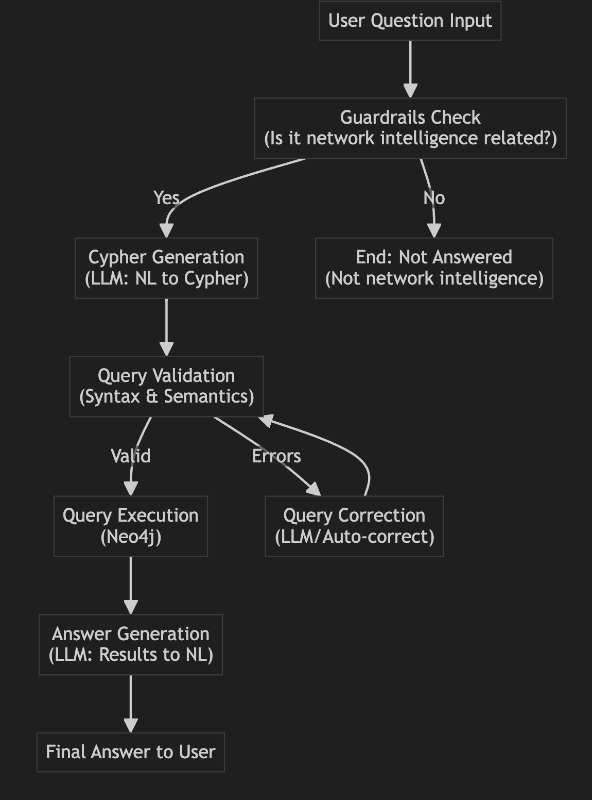

# Network Intelligent Platform

[🌐 **Try the Streamlit App Live**](https://network-intelligent-platform.streamlit.app/)

A sophisticated question-answering system over a Neo4j graph database using LangGraph for multi-step workflow management. This application can answer questions about people, organizations, and professional networking by converting natural language to Cypher queries and executing them against a Neo4j database.

## Features

- **Natural Language to Cypher**: Converts user questions to Cypher queries using LLM
- **Multi-step Workflow**: Uses LangGraph for sophisticated workflow management
- **Query Validation**: Validates and corrects generated Cypher queries
- **Guardrails**: Ensures questions are related to network intelligence before processing
- **Interactive Mode**: Command-line interface for asking questions
- **Error Handling**: Robust error handling and recovery mechanisms

## Architecture

The application follows a sophisticated multi-step workflow:

1. **Guardrails**: Validates if the question is related to network intelligence
2. **Cypher Generation**: Converts natural language to Cypher using few-shot examples
3. **Query Validation**: Validates syntax and semantics of generated queries
4. **Query Correction**: Automatically corrects errors in Cypher queries
5. **Query Execution**: Executes the Cypher query against Neo4j
6. **Answer Generation**: Generates natural language answers from results

## Prerequisites

- Python 3.8+
- Neo4j database (prebuild)
- OpenAI API key

## Installation

1. **Clone the repository**:
   ```bash
   git clone <repository-url>
   cd contacts-intelligent-knowledge-base
   ```

2. **Install dependencies**:
   ```bash
   pip install -r requirements.txt
   ```

3. **Set up environment variables**:
   Create a `.env` file in the root directory:
   ```env
   OPENAI_API_KEY=your_openai_api_key_here
   NEO4J_URI=bolt://localhost:7687
   NEO4J_USERNAME=neo4j
   NEO4J_PASSWORD=your_neo4j_password
   OPENAI_MODEL=gpt-4.1-nano
   OPENAI_TEMPERATURE=0
   ```

## Setup Neo4j Database

1. **Build Neo4j Database** from https://llm-graph-builder.neo4jlabs.com/

2. **Update the connection details** in your `.env` file

## Usage

### Quick Start

1. **Run the setup script**:
   ```bash
   python setup.py
   ```

2. **Update your `.env` file** with your actual API keys and database credentials

3. **Choose how to run the application**:

### Interactive Mode

Run the application in interactive mode to ask questions:

```bash
python main.py
```

Example questions:
- "Who are the key contacts at Company XYZ?"
- "What companies has John Smith worked for?"
- "List all people who work in the technology industry"
- "Which people have connections to both Company A and Company B?"

### Single Question Mode

Ask a single question from the command line:

```bash
python main.py "What does Michael Dell like?"
```


### Streamlit Interface

Run the Streamlit interface for an enhanced interactive experience:

```bash
streamlit run streamlit_app.py
```

## Project Structure

```
├── main.py              # Main application entry point
├── config.py            # Configuration management
├── database.py          # Neo4j database operations
├── models.py            # Data models and state management
├── chains.py            # LangChain chains and prompts
├── graph_workflow.py    # LangGraph workflow implementation
├── requirements.txt     # Python dependencies
└── README.md           # This file
```

## Configuration

### Environment Variables

- `OPENAI_API_KEY`: Your OpenAI API key (required)
- `NEO4J_URI`: Neo4j connection URI (default: bolt://localhost:7687)
- `NEO4J_USERNAME`: Neo4j username (default: neo4j)
- `NEO4J_PASSWORD`: Neo4j password (required)
- `OPENAI_MODEL`: OpenAI model to use (default: gpt-4.1-nano)
- `OPENAI_TEMPERATURE`: Model temperature (default: 0)

### Database Schema

The application works with a network intelligence database containing:
- **People**: Name, title, company, contact information
- **Organizations**: Company name, industry, size
- **Relationships**: WORKS_AT, KNOWS, COLLABORATED_WITH, etc.

## How It Works

The application follows a sophisticated multi-step workflow using LangGraph:



### Workflow Steps:

1. **Question Input**: User asks a question about people, organizations, or professional networking
2. **Guardrails Check**: System validates if the question is network intelligence-related
3. **Cypher Generation**: LLM converts question to Cypher using few-shot examples
4. **Query Validation**: System validates the generated Cypher query for syntax and semantics
5. **Query Correction**: If errors are found, the query is automatically corrected
6. **Query Execution**: The Cypher query is executed against Neo4j
7. **Answer Generation**: LLM generates a natural language answer from the results
